# 영화 리뷰 커뮤니티 with 로그인

## 프로젝트 소개

### 📆 프로젝트 기간

- 2022.10.14

### 🧑‍💻 사용 기술

- **언어** : Python, HTML, CSS, Javascript(ES6)
- **프레임워크** : Django, Bootstrap5

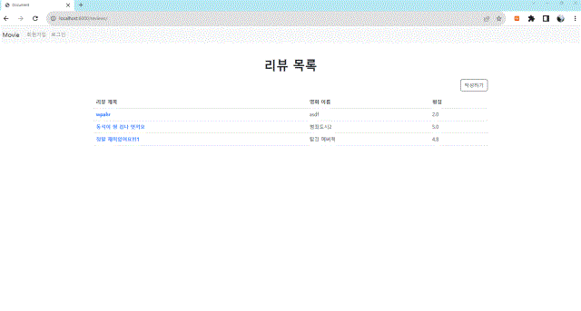

### 👩‍👧‍👦 Collaborators

[](https://github.com/hvvany/movie_login_pair/graphs/contributors)


## 목표

페어 프로그래밍을 통한 영화 리뷰 커뮤니티 서비스를 개발합니다. 아래 조건을 만족해야합니다.

- **CRUD** 구현
- **Staticfiles** 활용 정적 파일(이미지, CSS, JS) 다루기
- Django **Auth** 활용 회원 관리(회원가입 / 회원 조회 / 로그인 / 로그아웃)


##### 토픽

### 1. 깃 설정

`branch` main

- 원격 저장소 생성

- 콜라보레이터 초대

- 로컬 저장소 깃 초기화

  ```bash
  git init
  ```

- 로컬 저장소 .gitignore 생성

  ```bash
  touch .gitigngit ore
  ```

- .gitignore 작성

  - 아래 사이트 입력창에 필요한 언어 & 프레임워크 & 환경 입력 후 생성

  [gitignore.io](https://www.toptal.com/developers/gitignore/)


------

### 2. 장고 개발환경 설정

`branch` setup-django

Django 프로젝트 생성

- 가상환경 생성 & 실행

- 필요한 패키지 설치git

- 패키지 목록 저장

  ```bash
  pip freeze > requirements.txt
  ```

- Django 프로젝트 생성

  ```bash
  django-admin startproject config .
  ```


------

### 3. 회원가입

> 회원 가입 버튼을 누르면 개인 정보 입력 후 사용자가 등록된다. 회원 가입 완료 후 자동으로 로그인이 되도룩 구현하였다.

### 

`branch` accounts/signup

앱 App

앱 이름 : accounts

모델 Model

모델 이름 : User

- Django **AbstractUser** 모델 상속

**폼 Form**

- Django 내장 회원가입 폼 UserCreationForm을 상속 받아서 CustomUserCreationForm 작성

  해당 폼은 아래 필드만 출력합니다.

  - username
  - password1
  - password2

**기능 View**

회원가입

- `POST` http://127.0.0.1:8000/accounts/signup/
- CustomUserCreationForm을 활용해서 회원가입 구현

**화면 Template**

회원가입 페이지

- `GET` http://127.0.0.1:8000/accounts/signup/
- 회원가입 폼


------

### 4. 로그인

> 로그인 버튼을 누르면 사용자 데이터 검증 후 목록 페이지로 이동하도록 구현

### 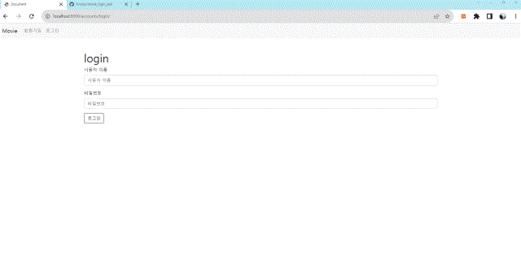

`branch` accounts/login

**폼 Form**

로그인

- Django 내장 로그인 폼 **AuthenticationForm 활용**

**기능 View**

로그인

- `POST` http://127.0.0.1:8000/accounts/login/
- **AuthenticationForm**를 활용해서 로그인 구현

**화면 Template**

로그인 페이지

- `GET` http://127.0.0.1:8000/accounts/login/
- 로그인 폼
- 회원가입 페이지 이동 버튼


------

### 5. 회원 목록 조회

> 회원 목록을 index에서 조회할 수 있도록 구현. 로그인 시에만 보이도록 하였다.

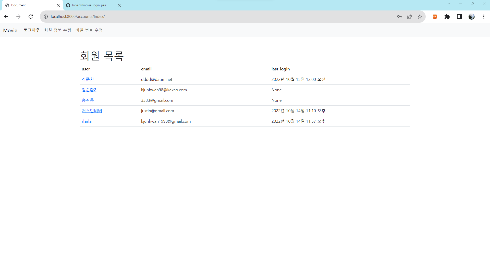

`branch` accounts/index

**기능 View**

회원 목록 조회

- `GET` http://127.0.0.1:8000/accounts/

**화면 Template**

회원 목록 페이지

- `GET` http://127.0.0.1:8000/accounts/
- 회원 목록 출력
- 회원 아이디를 클릭하면 해당 회원 조회 페이지로 이동


------

### 6. 회원 정보 조회

> 목록에서 회원 정보를 클릭하면 상세 정보를 보여준다.


`branch` accounts/detail

**기능 View**

회원 정보 조회

- `GET` http://127.0.0.1:8000/accounts/[int:user_pk](int:user_pk)/

**화면 Template**

회원 조회 페이지(프로필 페이지)

- `GET` http://127.0.0.1:8000/accounts/[int:user_pk](int:user_pk)/


------

### 7. 회원 정보 수정

> 내비게이션 바에서 로그인 후 회원정보 수정을 누르면 수정 폼으로 연결된다. 

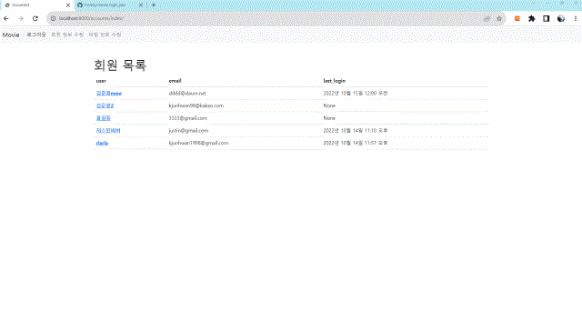

> 추가로 비밀번호 수정도 구현하였다. 

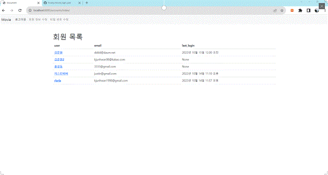

`branch` accounts/update

**폼 Form**

회원 정보 수정

- Django 내장 회원 수정 폼 UserChangeForm을 상속 받아서 **CustomUserChangeForm** 작성

  해당 폼은 아래 필드만 출력합니다.

  - first_name
  - last_name
  - email

**기능 View**

회원 정보 수정

- `POST` http://127.0.0.1:8000/accounts/update/

**화면 Template**

회원 정보 수정 페이지

- `GET` http://127.0.0.1:8000/accounts/update/


------

### 8. 로그아웃

> 로그아웃을 누르면 계정이 로그아웃 되며 모든 url 요청을 통한 접근을 @login_required를 통해 막는다.

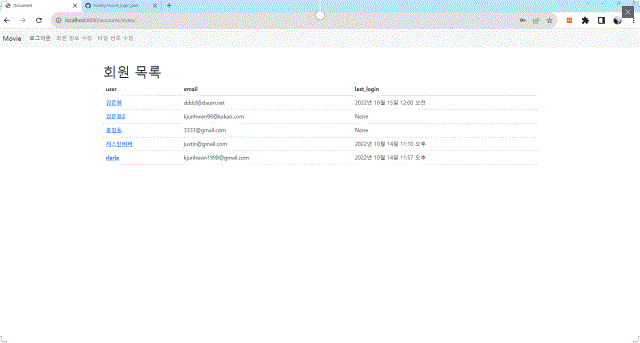

`branch` accounts/logout

**기능 View**

로그아웃

- `POST` http://127.0.0.1:8000/accounts/logout/


------

### 9. 네비게이션바

> 로그인, 로그아웃, 회원정보 수정을 네브바에 구현하였다. 로그인 상태에 따라 다르게 표시된다.

- 로그아웃 상태 _ 회원 가입 / 로그인

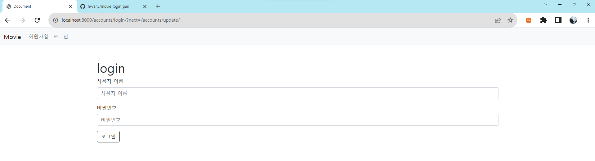

- 로그인 상태 _ 로그아웃 / 회원 정보 수정 / 비밀 번호 수정

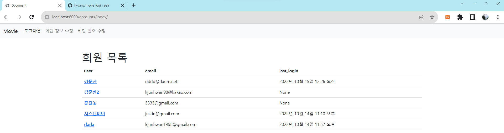

`branch` template/navbar

**화면 Template**

**네비게이션바**

- 리뷰 목록 페이지 이동 버튼
- 리뷰 작성 페이지 이동 버튼
- 비 로그인 유저는 작성 버튼 출력 X
- 로그인 상태에 따라 다른 화면 출력
  1. 로그인 상태
     - 로그인 한 사용자의 username 출력
       - username을 클릭하면 회원 조회 페이지로 이동
     - 로그아웃 버튼
  2. 비 로그인 상태
     - 로그인 페이지 이동 버튼
     - 회원가입 페이지 이동 버튼


------

### 10. 리뷰 생성

> 리뷰 게시글 작성페이지를 제작한다.

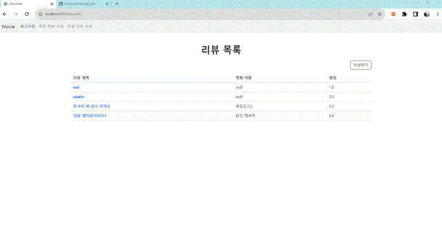

`branch` reviews/create

**앱 App**

앱 이름 : reviews

모델 Model

모델 이름 : Review

- 모델 필드

  | 이름       | 역할          | 필드     | 속성              |
  | ---------- | ------------- | -------- | ----------------- |
  | title      | 리뷰 제목     |          |                   |
  | content    | 리뷰 내용     |          |                   |
  | movie_name | 영화 이름     |          |                   |
  | grade      | 영화 평점     |          |                   |
  | created_at | 리뷰 생성시간 | DateTime | auto_now_add=True |
  | updated_at | 리뷰 수정시간 | DateTime | auto_now = True   |

**기능 View**

데이터 생성

- `POST` http://127.0.0.1:8000/reviews/create/

**화면 Template**

**리뷰 작성 페이지**

- `GET` http://127.0.0.1:8000/reviews/create/
- 리뷰 작성 폼


------

### 11. 리뷰 목록 조회

> 메인 페이지에 리뷰 목록이 뜨도록 구현


`branch` reviews/index

**기능 View**

데이터 목록 조회

- `POST` http://127.0.0.1:8000/reviews/

**화면 Template**

리뷰 **목록 페이지**

- `GET` http://127.0.0.1:8000/reviews/
- 리뷰 목록 출력
- 제목을 클릭하면 해당 리뷰의 정보 페이지로 이동


------

### 12. 리뷰 정보 조회

> 리뷰 목록에서 항목을 클릭하면 세부정보 표현

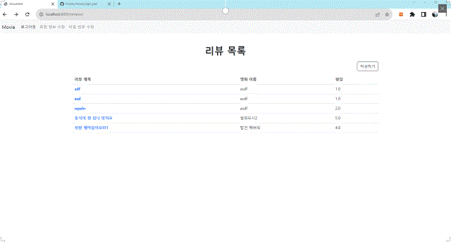

`branch` reviews/detail

**기능 View**

데이터 정보 조회

- `GET` http://127.0.0.1:8000/reviews/[int:review_pk](int:review_pk)/

**화면 Template**

**리뷰 정보 페이지**

- `GET` http://127.0.0.1:8000/reviews/[int:review_pk](int:review_pk)/
- 해당 리뷰 정보 출력
- 수정 / 삭제 버튼


------

### 13. 리뷰 정보 수정

> 세부 보기에서 수정을 누르면 글을 수정할 수 있다.

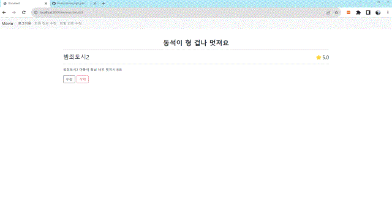

`branch` reviews/update

**기능 View**

데이터 수정

- `POST` http://127.0.0.1:8000/reviews/[int:review_pk](int:review_pk)/update/

**화면 Template**

**리뷰 수정 페이지**

- `GET` http://127.0.0.1:8000/reviews/[int:review_pk](int:review_pk)/update/
- 리뷰 수정 폼


------

### 14. 리뷰 삭제

> 삭제 버튼을 누르면 게시글이 삭제된다.

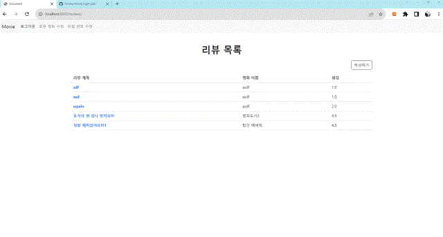

`branch` reviews/delete

**기능 View**

데이터 삭제

- `POST` http://127.0.0.1:8000/reviews/[int:review_pk](int:review_pk)/delete/

